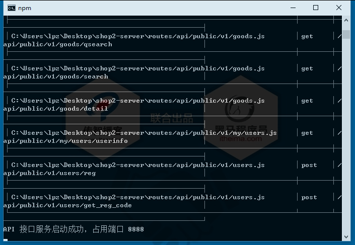
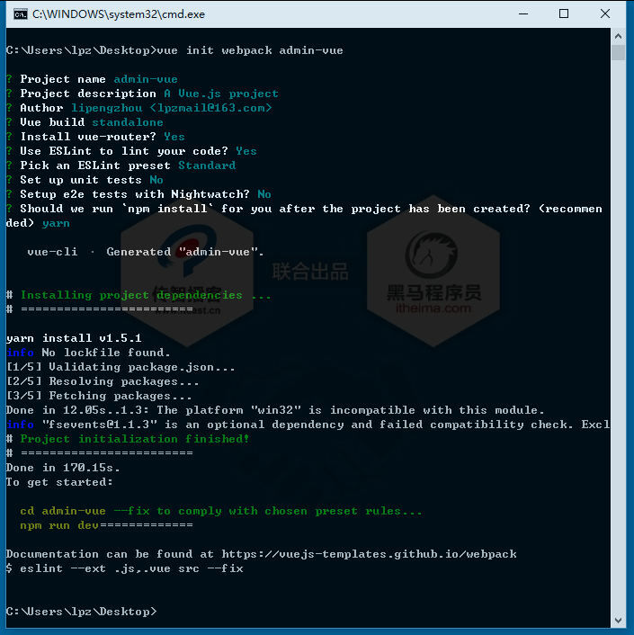
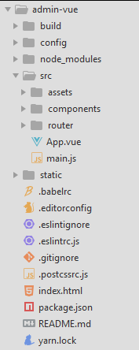

# 黑马程序员前端41期 Vue 电商后台管理系统开发文档

## 零、准备

### 将 API Server 部署到本地

- 创建一个名为 `itcast_mall` 的数据库
- 将 `mydb.sql` 导入 `itcast_mall` 数据库中
- 解压 `shop2-server.zip`
- 将 `shop2-server/config/default.json` 文件中 `db_config` 修改为自己的配置信息
- 打开终端，在 `shop2-server` 目录下执行 `npm start`

执行完 `npm start` 命令之后，如果看到如下提示信息则说明部署成功。



### API 接口文档

> http://shop-api.circle.ink/

### Postman 接口测试工具

- 是什么，解决什么问题
  + 官网：https://www.getpostman.com/
- 下载安装
- 使用

---

## 一、起步

### 使用 Vue CLI 初始化项目

- 是什么
- 解决什么问题
- 如何使用

**安装：**

```shell
npm install -g vue-cli
```

**查看使用帮助：**

```shell
vue --help
```

```
C:\Users\lpz\Desktop>vue --help

  Usage: vue <command> [options]

  Options:

    -V, --version  output the version number
    -h, --help     output usage information

  Commands:

    init           generate a new project from a template
    list           list available official templates
    build          prototype a new project
    help [cmd]     display help for [cmd]
```

**基于 [webpack](https://github.com/vuejs-templates/webpack) 模板初始化项目：**

```shell
# 基于 webpack 模板初始化一个名称为 admin-vue 的项目
vue init webpack admin-vue
```



启动开发模式：

```shell
cd admin-vue
yarn run dev
```


在浏览器中打开 `http://localhost:8080/` 访问测试。

### 项目结构介绍



```
build   webpack打包相关配置文件目录
config  webpack打包相关配置文件目录
docs  我们自己添加的文档目录
  开发文档.md  案例开发步骤文档
  接口文档.md  后台 API 接口文档
node_modules  第三发包
src  项目源码
  assegts  存储资源，例如 css、img、fonts
  components  存储所有组件
  router  路由
    index.js  路由配置文件
  App.vue  单页面应用程序的根组件
  main.js  开机键，负责把根组件替换到根节点
static  可以放一些静态资源
  .gitkeet  没啥用，用来充当一个文件就可以提交我们的 static 目录，未来有了其它文件可以把它删掉
.babelrc  es6转es5配置文件，给 babel 编译器用的
.editorconfig  给编辑器看的
.eslintignore  给eslint代码风格校验工具使用的，用来配置忽略代码风格校验的文件或是目录
.eslintrc.js  给eslint代码风格校验工具使用的，用来配置代码风格校验规则
.gitignore  给git使用的，用来配置忽略上传的文件
.postcssrc.js  给postcss用的，postcss类似于 less、sass 预处理器
index.html  单页面应用程序的单页
package-lock.json  锁定第三方包的版本，以及保存包的下载地址
package.json  项目说明，用来保存依赖项等信息
REAMDE.md  项目说明文档
```

### 代码风格

我们的项目采用 [JavaScript Standard Style](https://standardjs.com/) 代码风格，以下是一些基本规范细则。

- **使用两个空格** – 进行缩进
- **字符串使用单引号** – 需要转义的地方除外
- **不再有冗余的变量** – 这是导致 *大量* bug 的源头!
- **无分号** – [这](http://blog.izs.me/post/2353458699/an-open-letter-to-javascript-leaders-regarding)[没什么不好。](http://inimino.org/~inimino/blog/javascript_semicolons)[不骗你！](https://www.youtube.com/watch?v=gsfbh17Ax9I)
- 行首不要以 `(`, `[`, or ``` 开头
  - 这是省略分号时**唯一**会造成问题的地方 – *工具里已加了自动检测！*
  - [详情](https://github.com/standard/standard/blob/master/docs/RULES-zhcn.md#semicolons)
- **关键字后加空格** `if (condition) { ... }`
- **函数名后加空格** `function name (arg) { ... }`
- 坚持使用全等 `===` 摒弃 `==` 一但在需要检查 `null || undefined` 时可以使用 `obj == null`。
- 一定要处理 Node.js 中错误回调传递进来的 `err` 参数。
- 使用浏览器全局变量时加上 `window` 前缀 – `document` 和 `navigator` 除外
  - 避免无意中使用到了这些命名看上去很普通的全局变量， `open`, `length`, `event` 还有 `name`。

说了那么多，看看[这个遵循了 Standard 规范的示例文件](https://github.com/expressjs/body-parser/blob/master/index.js) 中的代码吧。或者，这里还有[一大波使用了此规范的项目](https://raw.githubusercontent.com/standard/standard-packages/master/all.json) 代码可供参考。

### 加入 Git 版本控制

初始化本地仓库并完成一次提交。

```shell
git init
git status
git add --all
git commit -m ":tada: Initial commit"
```

在 GitHub 上创建一个在线仓库。

将本地项目推送到 GitHub。

```shell
git remote add origin https://github.com/你的GitHub用户名/admin-vue.git
git push -u origin master
```

### Git 工作流程

[阮一峰 - Git 工作流程](http://www.ruanyifeng.com/blog/2015/12/git-workflow.html)

### 拉出分支开始工作吧

- 功能性分支
- dev-login
- feat-login
- 功能分支开发完成之后测试没问题了合并到 master 分支
- 之后就可以删除掉特性分支

### 使用 axios 结合 async 函数发起登陆请求处理

### 导入 ElementUI

> 参考文档：http://element-cn.eleme.io/#/zh-CN/component/quickstart

安装依赖：

```shell
# 或者 npm install element-ui
yarn add element-ui
```

在 `src/main.js` 中加载使用：

```javascript
import Vue from 'vue'
import ElementUI from 'element-ui'
import 'element-ui/lib/theme-chalk/index.css'
import App from './App'
import router from './router'

Vue.use(ElementUI)

Vue.config.productionTip = false

/* eslint-disable no-new */
new Vue({
  el: '#app',
  router,
  components: { App },
  template: '<App/>'
})

```

### 布局登陆组件

把公共样式写到 `src/assets/css/style.css` ：

```css
html, body {
  height: 100%;
}

body {
  margin: 0;
  padding: 0;
}

```

然后在 `src/main.js` 加载公共样式：

```javascript
// 代码略...

// 引入我们的公共样式
import './assets/css/style.css'

// 代码略...

```

为了让登陆组件的背景色撑满，所以我们需要让他们的父盒子 `div#app` 高度设置为 `100%`。

所以我们在 `src/App.vue` ：

```css
<style>
#app {
  height: 100%;
}
</style>
```

接下来我们开始调整 `src/components/login/login.vue` 组件样式：

- 注意：这里遵循一个原则，不要直接去使用 Element 组件自带的类名
- 如果你想为 Element 组件添加自定义样式，那么建议你给它加你自己的类名来控制

```css
<style>
.login-wrap {
  background-color: #324152;
  height: 100%;
  display: flex;
  justify-content: center;
  align-items: center;
}

.login-wrap .login-from {
  background-color: #fff;
  width: 400px;
  padding: 30px;
  border-radius: 5px;
}

.login-wrap .login-from .login-btn {
  width: 100%;
}
</style>
```


### 布局 Home 组件

这里我们可以使用 Element 组件库中的 [Container 布局容器(http://element.eleme.io/#/zh-CN/component/container) 实现基本结构。

在 `src/components/home/home.vue` 文件模板：

```html
<template>
  <el-container class="container">
    <el-header class="header">Header</el-header>
    <el-container class="container">
      <el-aside class="aside" width="200px">Aside</el-aside>
      <el-main class="main">Main</el-main>
    </el-container>
  </el-container>
</template>
```

在 `src/components/home/home.vue` 组件样式：

```css
.container {
  height: 100%;
}

.header {
  background-color: #B3C0D1;
}

.aside {
  background-color: #D3DCE6;
}

.main {
  background-color: #E9EEF3;
  height: 100%;
}
```

### 调整 Header 头部样式

这里我们使用的是 Element 组件库自带的 [Layout 布局](http://element.eleme.io/#/zh-CN/component/layout) 来完成 Header 组件基本样式结构。

```html
<el-header class="header">
  <el-row>
    <el-col :span="4"><div class="grid-content bg-purple"></div></el-col>
    <el-col :offset="16" :span="4"><div class="grid-content bg-purple"><a href="#">退出</a></div></el-col>
  </el-row>
</el-header>
```

## 校验登陆状态拦截视图导航


在 `src/components/login/login` 组件中，用户登陆成功，将 Token 记录到本地存储中

```javascript
async login () {
  // 1. 采集表单数据
  // 2. 表单验证
  // 3. 发请求执行登陆操作
  // 4. 根据响应做交互
  const res = await axios.post('http://localhost:8888/api/private/v1/login', this.userForm)
  const data = res.data
  if (data.meta.status === 200) {
    // 登陆成功，将服务器签发给用户的 Token 身份令牌记录到 localStorage 中
    // 其它需要使用 Token 的都去本地存储获取
    window.localStorage.setItem('admin-token', JSON.stringify(data.data))
    this.$router.push({
      name: 'home'
    })
  }
}
```

除登陆组件之外，都必须校验身份令牌，如果未登陆，则跳转到登陆组件。

这里我们可以使用路由导航钩子来帮助我们完成这件事儿。

在 `src/router/index.js` 路由中增加全局导航拦截权限认证：

```javascript
import Vue from 'vue'
import Router from 'vue-router'
import Login from '@/components/login/login' // @ 是 src 路径的别名，webpack 配置的
import Home from '@/components/home/home' // @ 是 src 路径的别名，webpack 配置的

Vue.use(Router)

const router = new Router({
  routes: [
    {
      name: 'login',
      path: '/login',
      component: Login
    },
    {
      name: 'home',
      path: '/',
      component: Home
    }
  ]
})

// 1. 添加路由拦截器（导航钩子、守卫）
//    接下来所有的视图导航都必须经过这道关卡
//    一旦进入这道关卡，你得告诉路由守卫，
//    to 我要去哪里
//    from 我从哪儿来的
//    next 用来放行的
router.beforeEach((to, from, next) => { // 1. 添加全局路由导航守卫
  // 2.
  // 拿到当前请求的视图路径标识
  // 2.1 如果是登陆组件，则直接放行通过
  // 2.2 如果是非登陆组件，则检查 Token 令牌
  //    2.2.1 有令牌就过去
  //    2.2.2 无令牌，则让其登陆去
  if (to.name === 'login') { // 2.1 如果是访问登陆组件，则让其通过
    next()
  } else {
    // 检查登陆状态令牌
    const token = window.localStorage.getItem('admin-token')
    if (!token) { // 2.2.1 无令牌，则让其登陆去
      next({
        name: 'login'
      })
    } else { // 2.2.2 有令牌就允许通过
      next()
    }
  }
})

export default router

```

## 用户退出

1. 清空本地存储中的用户身份标识
2. 跳转到登陆组件

```javascript
logout () {
  this.$confirm('确认退出吗?', '退出提示', {
    confirmButtonText: '确定',
    cancelButtonText: '取消',
    type: 'warning'
  }).then(() => { // 点击确认执行 resolve 函数
    // 1. 删除本地存储中的 Token 身份标识
    window.localStorage.removeItem('admin-token')
    // 2. 跳转到登陆视图
    this.$router.push({
      name: 'login'
    })
    this.$message({
      type: 'success',
      message: '退出成功!'
    })
  }).catch(() => {
    // 点击取消的处理
  })
}
```
## 封装 auth 模块处理用户登陆信息及token

在 `src/assets/js/auth.js` 文件模块中：

```javascript
/**
 * @/assets/js/auth.js
 * 封装和用户授权相关函数
 */

const userInfoKey = 'user-info'

/**
 * 保存登陆用户信息到本地存储
 * @param  {Object} userInfo 用户登陆成功的信息对象
 * @return {undefined}     无返回值
 */
export function saveUserInfo (userInfo = {}) {
  window.localStorage.setItem(userInfoKey, JSON.stringify(userInfo))
}

/**
 * 从本地存储中获取当前登陆用户信息
 * @return {string} 当前登陆用户信息对象字符串
 */
export function getUserInfo () {
  return window.localStorage.getItem(userInfoKey)
}

/**
 * 获取本地存储中用户信息的 Token 令牌
 * @return {string} 用户的 Token 身份令牌
 */
export function getToken () {
  return JSON.parse(getUserInfo()).token
}

/**
 * 删除本地存储中的用户登陆信息
 * @return {undefined} 无返回值
 */
export function removeUserInfo () {
  window.localStorage.removeItem(userInfoKey)
}

```

接下来依次修改：

- 用户登陆成功，调用 `saveUserInfo()` 方法将服务端响应的用户信息对象存储到本地存储
- 路由拦截器中，调用 `getUserInfo()` 获取用户信息用以判定是否已登录
- 用户退出，调用 `removeUserInfo()` 删除本地存储中的用户信息
- 用户列表组件获取用户列表数据，调用 `getToken()` 获取用户的身份标识用以访问需要授权的 API 接口


## 将 axios 扩展为 Vue 插件

> 为 Vue 扩展插件：https://cn.vuejs.org/v2/guide/plugins.html

我们在使用 axios 的时候遇到了一些问题：

- 请求路径
- 每一次都要 import 载入
- 所有需要授权的 API 都要配置请求头 Token
  - 利用请求拦截器，参考文档：https://github.com/axios/axios#interceptors


在 `src/assets/js/http.js`:

```javascript
import axios from 'axios'
import {getToken} from './auth'

const http = axios.create({
  baseURL: 'http://localhost:8888/api/private/v1/'
})

// 我们这里使用 http 请求拦截器的目的是为了解决：每次请求需要授权的API手动在请求头中加 Token 令牌的问题
// 添加请求拦截器
// 拦截器的本身就是一个方法
// 该方法什么时候执行？
// 拦截器函数接收一个参数 config
// config 就是你当前请求的配置对象
// 当你使用 axios 发起请求的时候，那么就会先经过这个拦截器然后再发出请求
// 也就是说在请求拦截器内部的请求还没有发出去
// 我们可以在这里定制请求之前的行为
http.interceptors.request.use(function (config) {
  // 如果本次请求的不是 /login 接口，则我们就加入请求头
  if (config.url !== '/login') {
    config.headers['Authorization'] = getToken()
  }

  // return config 就好比 next() 允许通过
  // 通过之后才要真正的发起请求
  return config
}, function (error) { // 当请求出错的时候会调用到第二个参数函数
  // Do something with request error
  return Promise.reject(error)
})

// 建议通过定义插件的配置来扩展 Vue 本身
// 1. 定义一个插件对象
const httpPlugin = {}

// 2. 为插件对象添加一个成员：install
//    install 是一个函数
//    该函数接收两个参数：Vue、options
//
//   Vue.use(httpPlugin) 会来调用 install 方法
httpPlugin.install = function (Vue, options) {
  // 3. 添加实例方法
  Vue.prototype.$http = http
}

// 4. 导出插件对象
export default httpPlugin

// 5. 在入门文件模块 main.js 加载使插件生效
// Vue.use(httpPlugin)

```

然后在 `src/main.js` 文件中加载插件使之生效：

```javascript
// ...代码略
import httpPlugin from '@/assets/js/http'
Vue.use(httpPlugin)
// ...代码略
```

接下来我们就可以在组件中直接通过 `this.$http` 来使用 `axios` 了。

```javascript
async created () {
  // ...代码略
  const res = await this.$http.get('/users', {
    // ...代码略
  })
  // ...代码略
}
```

## 配置侧边栏导航菜单

> 参考文档：[Element - Navbar 导航菜单](http://element-cn.eleme.io/#/zh-CN/component/menu)

## 二、用户管理

1. 创建用户列表组件
2. **配路由表（重点：子路由）**
3. 处理侧边栏导航
4. 布局用户列表组件
5. 请求用户列表数据，渲染到用户列表组件
   1. 发请求，得到数据
   2. 处理数据，渲染到组件模板


### 表格列表渲染

我们可以直接在用户列表组件的 `created` 生命钩子函数中发起请求加载表格数据：

```javascript
export default {
  // ...
  async created () {
    const res = await this.$http.get('/users', {
      params: { // 请求参数，对象会被转换为 k=v&k=v 的格式，然后拼接到请求路径 ? 后面发起请求
        pagenum: 1,
        pagesize: 2
      }
    })
    const {users} = res.data.data
    this.tableData = users
  }
  // ...
}

```


### 分页处理

首先我们把接口返回的 `total` 总记录数交给分页插件帮我们完成页码分页：

```javascript
export default {
  // ...
  async created () {
    const res = await this.$http.get('/users', {
      params: { // 请求参数，对象会被转换为 k=v&k=v 的格式，然后拼接到请求路径 ? 后面发起请求
        pagenum: 1,
        pagesize: 2
      }
    })
    const {users, total} = res.data.data
    this.tableData = users
  }
  // ...
}

```

我们发现分页插件已经根据我们给定的每页大小以及总记录数完成了分页页码功能。

接下来我们来处理点击页码加载对应页码数据的功能。这里我们可以使用分页插件提供的 `current-change` 事件，在该事件处理函数中我们可以接收到分页插件传递给我们的当前页码。

```javascript
export default {
  // ...
  methods: {
    handleCurrentChange (val) { // 页码改变的时候，该函数会被调用，并得到当前页码
      const res = await this.$http.get('/users', {
        params: {
          pagenum: val, // 将当前页码传递给服务器接口
          pagesize: 2
        }
      })
      const {users, total} = res.data.data
      this.tableData = users
      this.total = total
    }
  }
  // ...
}

```

我们已经发现 `created` 钩子函数中加载用户列表数据和 `handleCurrentChange()` 函数中的代码已经几乎一样了。所以我们可以封装一个函数用来根据页码加载对应的分页数据，然后分别在 `created` 钩子和 `handleCurrentChange()` 函数中进行调用。

```javascript
export default {
  // ...
  methods: {
    created () {
      // 组件初始化默认加载第1页数据
      this.loadUsersByPage(1)
    },
    handleCurrentChange (val) {
      // 页码改变的时候获取当前页码数据
      this.loadUsersByPage(val)
    },
    loadUsersByPage (page) { // 页码改变的时候，该函数会被调用，并得到当前页码
      const res = await this.$http.get('/users', {
        params: {
          pagenum: page,
          pagesize: 2
        }
      })
      const {users, total} = res.data.data
      this.tableData = users
      this.total = total
    }
  }
  // ...
}

```

处理完页码改变加载对应页码数据之后，接下来我们看一下如何实现分页插件的动态切换页码大小改变功能。

我们可以看到分页插件同时为页码大小改变提供了一个自定义事件 `size-change`。在该事件处理函数中我们可以动态的接收到当前用户选择的每页页码大小。

接下来我们稍微改造一下 `loadUsersByPage() ` 函数，并在 `size-change` 事件绑定的 `handleSizeChange` 函数中调用。

```javascript
export default {
  // ...
  methods: {
    created () {
      // 组件初始化默认加载第1页数据
      this.loadUsersByPage(1)
    },
    handleCurrentChange (val) {
      // 页码改变的时候获取当前页码数据
      this.loadUsersByPage(val)
    },
    handleSizeChange (val) { // val 就是当前用户选择的每页大小
      this.loadUsersByPage(1, val)
    },
    loadUsersByPage (page, pageSize = 2) { // 加入了一个新的动态参数 pageSize 用来指定每页大小，默认为 2
      const res = await this.$http.get('/users', {
        params: {
          pagenum: page,
          pagesize: pageSize
        }
      })
      const {users, total} = res.data.data
      this.tableData = users
      this.total = total
    }
  }
  // ...
}

```

让我们来测试一下，我们发现切换每页大小确实已经可以实现我们想要的功能了。

:smile::smile::smile:

:smile::smile::smile:

:smile::smile::smile:

等等，我们发现页码大小改变之后，点击页码，加载的始终是 2 条数据。

这是为啥？

哦，因为我们在 `loadUsersByPage()` 函数中设定的 `pageSize` 默认大小就是 2。而无论改变之前还是改变之后，页码的改变都是在调用该函数，页码改变的时候调用该函数并没有指定当前用户选择的**最新每页大小**。

原来是这样的。

好吧，接下来我们可以在 `data` 中添加一个成员 `pageSize` 用来存储我们当前的每页大小。

```javascript
export default {
  data () {
    return {
      searchText: '',
      tableData [],
      total: 0,
      pageSize: 2
    }
  },
  methods: {
    created () {
      // 组件初始化默认加载第1页数据
      this.loadUsersByPage(1)
    },
    handleCurrentChange (val) {
      // 页码改变的时候获取当前页码数据
      this.loadUsersByPage(val)
    },
    handleSizeChange (val) { // val 就是当前用户选择的每页大小
      this.pageSize = val // 将改变之后的每页大小实时的存储起来
      this.loadUsersByPage(1, val)
    },
    loadUsersByPage (page) { // 加入了一个新的动态参数 pageSize 用来指定每页大小，默认为 2
      const res = await this.$http.get('/users', {
        params: {
          pagenum: page,
          pagesize: this.pageSize // 该数据是动态的，在 data 中默认为 2，当用户点击切换每页大小的时候会修改该数据
        }
      })
      const {users, total} = res.data.data
      this.tableData = users
      this.total = total
    }
  }
  // ...
}

```

至此我们终于完成了每页大小改变并动态加载对应的页码大小数据。

但是！

还没有结束:sunglasses::joy:

我们发现每页大小改变之后我们会让页码从第1页开始加载，但是我们的页码高亮状态并没有回归到第1页。

好吧，我们继续。

我们看到分页插件有一个 `current-page` 属性，我们可以使用该属性告诉分页插件让哪个页码高亮，我们可以分别尝试给定1、2、3 查看页码高亮的样式是否会发生变化。

接下来我们就利用 `current-page` 属性修正页码高亮问题。

首先在 `data` 中添加一个成员 `currentPage`，然后在分页插件模板中同步绑定 `currentPage`。

```html
<template>
  ...
    <el-pagination
      @size-change="handleSizeChange"
      @current-change="handleCurrentChange"
      :current-page.sync="currentPage"
      :page-sizes="[1, 2]"
      layout="total, sizes, prev, pager, next, jumper"
      :total="totalSize">
    </el-pagination>
  ...
</template>

<script>
  export default {
    data () {
      return {
        // ...
        currentPage: 1
        // ...
      }
    }
  }
</script>
```

我们通过调试工具发现，每页分页页码改变，我们的数据成员 `currentPage` 也会随之同步改变。

最后，让我们在 `handleSizeChange()` 函数中加载用户列表完成之后，手动将 `currentPage` 指定为 1。

```javascript
export default {
  // ...
  methods: {
    // ...
    handleSizeChange (val) { // val 就是当前用户选择的每页大小
      this.pageSize = val // 将改变之后的每页大小实时的存储起来
      this.loadUsersByPage(1, val)
      this.currentPage = 1 // 将当前页码设定为 1
    }
    // ...
  }
  // ...
}

```


恭喜，终于使用分页插件完成了我们想要的分页功能。过程虽然麻烦，但是我们的前途一片光明。共勉！！！:smile::smile::smile:

### 列表搜索

- 业务分析
- 接口测试


- 绑定点击搜索事件处理函数
- 调用加载用户列表数据方法

### 修改用户状态

- 业务分析


- 接口测试


- [Switch 开关](http://element-cn.eleme.io/#/zh-CN/component/switch) 的 change 事件
- 自定义事件绑定传参

### 添加用户

- 业务分析


- 接口测试
- [DIalog 对话框](http://element-cn.eleme.io/#/zh-CN/component/dialog)
- 表单布局 + 数据绑定
- 提交表单添加用户
- 添加用户成功，重新加载用户列表

### 删除用户

- 业务分析


- 接口测试
- 注册点击删除事件处理函数
- 使用 [MessageBox 弹框](http://element-cn.eleme.io/#/zh-CN/component/message-box) 给出删除操作提示
- 根据用户 id 执行删除操作
- 删除成功，重新加载当前分页数据

### 编辑用户

- 业务分析


- 接口测试
- 注册点击编辑时间处理函数
- 使用 [Dialog 对话框](http://element-cn.eleme.io/#/zh-CN/component/dialog) 弹出编辑窗口
- 将要编辑的用户信息渲染到编辑窗口中
- 处理编辑操作

### 角色分配

## 三、权限管理

- 权限管理就是让登陆系统的不同角色拥有不同操作权限。
- 权限
- 角色
- 用户

### 权限列表

- 业务分析
- 接口测试
- 功能实现

### 角色列表

- 业务分析
- 接口测试
- 功能实现

### 添加角色

- 业务分析
- 接口测试
- 功能实现

### 删除角色

- 业务分析
- 接口测试
- 功能实现

### 修改角色

- 业务分析
- 接口测试
- 功能实现